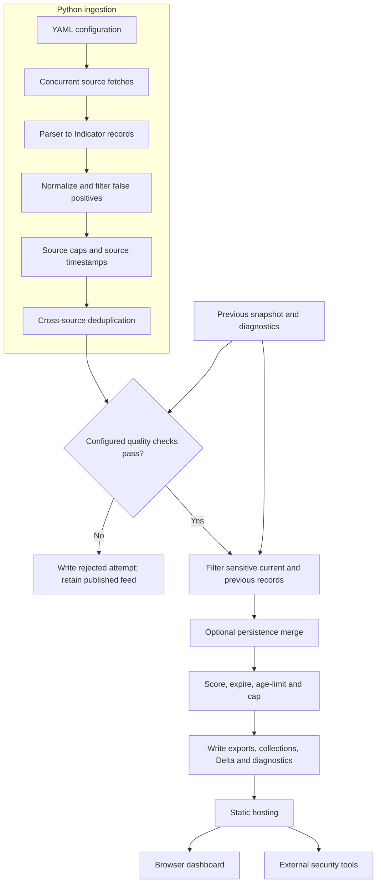
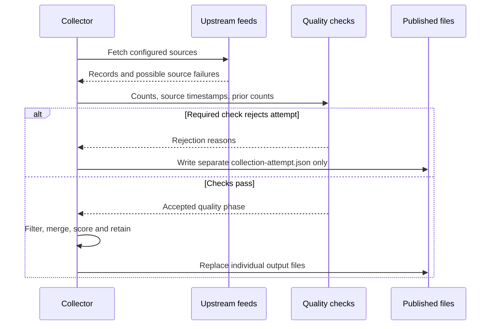

# Architecture and execution flow

SwiftIOC has two runtimes connected by published files: a scheduled Python producer and a browser consumer. Static hosting distributes the output. Analysts' queue and inventory state are managed in the browser.

This diagram shows the publication boundary: source quality checks occur before sensitive-record filtering, persistence and retention. Therefore, source ingestion counts can be larger than final exported counts. A quality-pass result does not guarantee that all later disk writes or deployment succeeded.

## Code map

| Module | Responsibility |
| --- | --- |
| `cli.py` | Arguments, configuration, baseline, orchestration, quality decision, publication. |
| `collect.py` | Concurrent source work, caps, aggregation, deterministic deduplication, diagnostics. |
| `http_client.py` | Sessions, retry policy, redirect checks, response cap, raw capture, HTTP metrics. |
| `parsers.py` / `extract.py` | Provider adapters and extraction into common records. |
| `models.py` / `fp.py` | Identity, normalization, classification and false-positive rules. |
| `scoring.py` | Relevance explanation, baseline loading, persistence, decay, retention. |
| `quality.py` / `publication.py` | Required-source checks and targeted sensitive-data filtering. |
| `writers.py` / `collections.py` | Formats, separate observable/CVE collections, Delta, atomic file writes. |
| `detections.py` / `verify_detections.py` | Detection compilation and offline artifact consistency verification. |
| `public/assets/dashboard-core.js` | Pure browser data logic, graph model, searches, workspace transformations. |
| `public/assets/dashboard.js` | DOM, fetching, controls, rendering, local workspace state. |
| `public/assets/inventory-core.js` / `inventory.js` | Applicability comparison and exposure-report UI. |

## One record's lifecycle

Suppose two sources report the same IP. Their parsers emit records with source names and timestamps. Normalization gives both the same `(type, indicator)` identity. Deduplication merges their provenance. Persistence can recover an earlier first-seen date and increment sightings. Scoring ranks its current relevance. Retention determines whether it is published. The dashboard then exposes evidence and lets an analyst add it to a hunt.

An older carried-forward record is copied before rescoring. Otherwise, mutating the current record would also mutate the previous baseline and hide score changes in Delta.

## Failure boundaries

Writers use temporary files and replacement so a reader does not see a half-written individual file. **The whole directory is not one transaction.** A disk error between files can leave different generations. Current baseline validation checks usable row counts against diagnostics; it is not a cryptographic identity check. Immutable generation directories with a single manifest switch are a useful future improvement.

**Read the implementation:** [CLI](https://github.com/PKHarsimran/SwiftIOC-Automated-Threat-Intelligence-Collector/blob/2725dbf95fe719b45e6d4e2d50d1952b2b34784f/swiftioc/cli.py), [collection](https://github.com/PKHarsimran/SwiftIOC-Automated-Threat-Intelligence-Collector/blob/2725dbf95fe719b45e6d4e2d50d1952b2b34784f/swiftioc/collect.py), [writers](https://github.com/PKHarsimran/SwiftIOC-Automated-Threat-Intelligence-Collector/blob/2725dbf95fe719b45e6d4e2d50d1952b2b34784f/swiftioc/writers.py).

---
[Wiki home](https://github.com/PKHarsimran/SwiftIOC-Automated-Threat-Intelligence-Collector/wiki) · [Interview guide](https://github.com/PKHarsimran/SwiftIOC-Automated-Threat-Intelligence-Collector/wiki/Interview-Guide) · [Documentation map](https://github.com/PKHarsimran/SwiftIOC-Automated-Threat-Intelligence-Collector/wiki/Reference-and-Glossary)

*Reviewed against main at `2725dbf9` on 21 September 2026. Live feed counts change between collections.*
