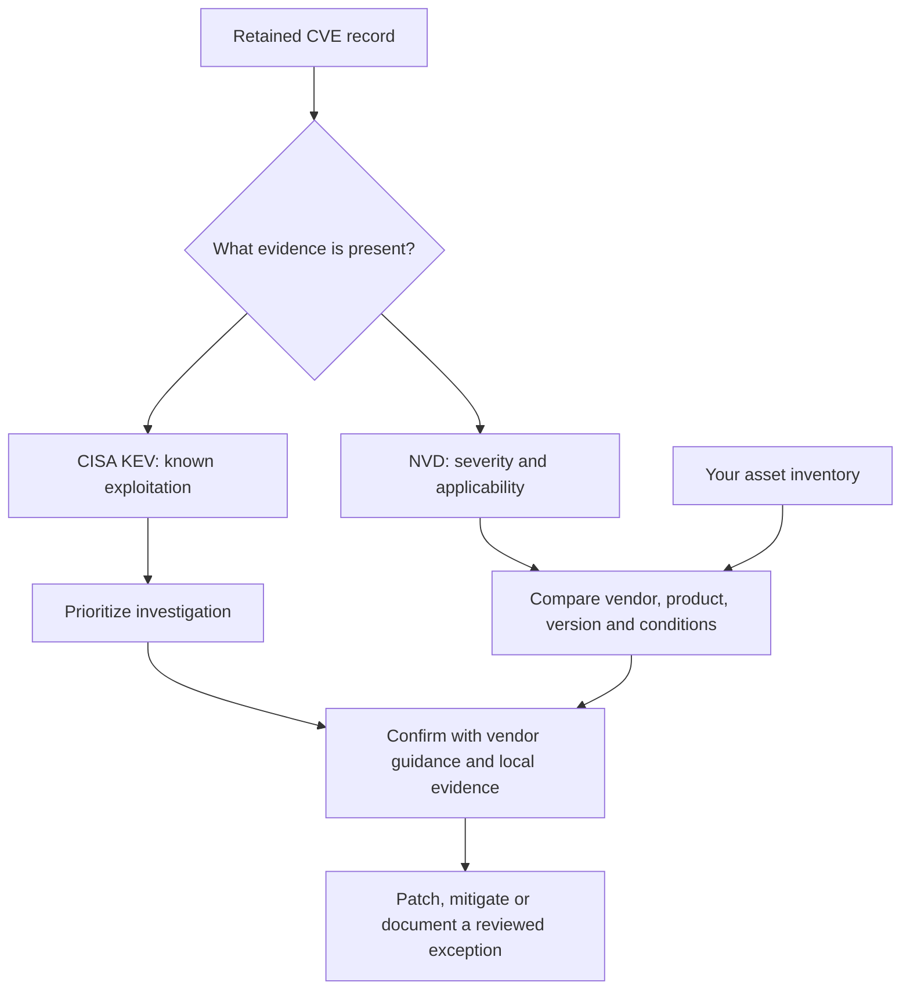

# Prioritize CVEs using evidence

A CVE identifies a vulnerability. CISA KEV inclusion indicates known exploitation; NVD severity describes potential impact and applicability metadata. Neither confirms that a particular asset is vulnerable or currently compromised.



## Read the dates correctly

| Date | Question it answers |
| --- | --- |
| CVE publication | When was this vulnerability record published? |
| CVE modification | When did the provider update the record? |
| KEV addition | When did CISA add known-exploitation evidence to its catalog? |
| Catalog check / collection | When did SwiftIOC retrieve or check the evidence? |
| Due date | What action deadline does the provider report? Apply your organization's obligations separately. |

An old CVE newly added to KEV can be urgent. A newly published high-severity CVE may lack exploitation evidence. The default view starts with Known exploited when no products are watched; other views broaden to all CVEs, ransomware evidence, recent KEV additions and recent publication/updates. Rejected records are hidden by default in general views.

## My briefing: track products

Add up to **20 exact vendor/product watches** using structured CISA fields. The first matching valid snapshot establishes a baseline without calling all historical CVEs new. Later visits highlight records newly entering your watched set and material evidence changes, such as exploitation status, ransomware evidence, severity, required action or due date.

Mark items Investigating or Reviewed and export the briefing with evidence and triage state. Routine poll timestamps do not cause alerts. Invalid/out-of-order snapshots cannot advance the baseline. The browser retains at most **5,000 baseline records**; narrow watches when the UI reports the limit. Rejected status changes remain available when needed to explain an update.

Watches do not translate arbitrary software names to CPE identities. NVD-only records without CISA vendor/product fields may not match. Watches are browser-local and do not provide background notifications or complete catalog coverage.

## Exposure report: compare assets

Import JSON with up to **200 assets / 500 KB**. Download the UI's sample first. An illustrative inventory file is:

```json
{
  "schema_version": 1,
  "assets": [{
    "id": "training-web-01",
    "vendor": "Example Vendor",
    "product": "Example Product",
    "version": "2.4.0",
    "exposure": "internet",
    "importance": "critical"
  }]
}
```

The required envelope is `schema_version: 1` with an `assets` array. This example is synthetic, not a real vulnerable product assertion. Each `id` must be unique. Optional `cpe_vendor`, `cpe_product` and `cpe_part` must use explicit CPE identifiers; the default part is application (`a`), with operating system (`o`) and hardware (`h`) supported. Display names are not automatically mapped to CPE names.

| Finding | Correct interpretation |
| --- | --- |
| Version match | Available supported applicability evidence matches the supplied identity/version; confirm installation and conditions. |
| Needs verification | Product evidence exists but version or configuration evidence is insufficient/complex. |
| Outside reported range | Supported reported constraints exclude the supplied version; other evidence or vulnerabilities may still apply. |
| No retained match | No match in this bounded snapshot, not proof of safety. |

Exact CPE versions are literal: `2.4` must not automatically equal `2.4.0`. Dotted-numeric comparison is reserved for supported range boundaries. Complex platform conditions and unsupported version ordering remain uncertain. CISA-only product matches cannot establish affected versions.

The matcher indexes records by product before asset assessment to avoid repeatedly traversing every NVD configuration for every asset. Reports paginate and export up to a disclosed **10,000 findings**. Failed, future or out-of-order snapshot refreshes disable assessment until usable evidence returns. Inventory stays in current-tab memory.

**Code:** [inventory core](https://github.com/PKHarsimran/SwiftIOC-Automated-Threat-Intelligence-Collector/blob/2725dbf95fe719b45e6d4e2d50d1952b2b34784f/public/assets/inventory-core.js), [CVE collections](https://github.com/PKHarsimran/SwiftIOC-Automated-Threat-Intelligence-Collector/blob/2725dbf95fe719b45e6d4e2d50d1952b2b34784f/swiftioc/collections.py). Next: [SPL limitations](https://github.com/PKHarsimran/SwiftIOC-Automated-Threat-Intelligence-Collector/wiki/SPL-and-Integrations).

---
[Wiki home](https://github.com/PKHarsimran/SwiftIOC-Automated-Threat-Intelligence-Collector/wiki) · [Interview guide](https://github.com/PKHarsimran/SwiftIOC-Automated-Threat-Intelligence-Collector/wiki/Interview-Guide) · [Documentation map](https://github.com/PKHarsimran/SwiftIOC-Automated-Threat-Intelligence-Collector/wiki/Reference-and-Glossary)

*Reviewed against main at `2725dbf9` on 21 September 2026. Live feed counts change between collections.*
