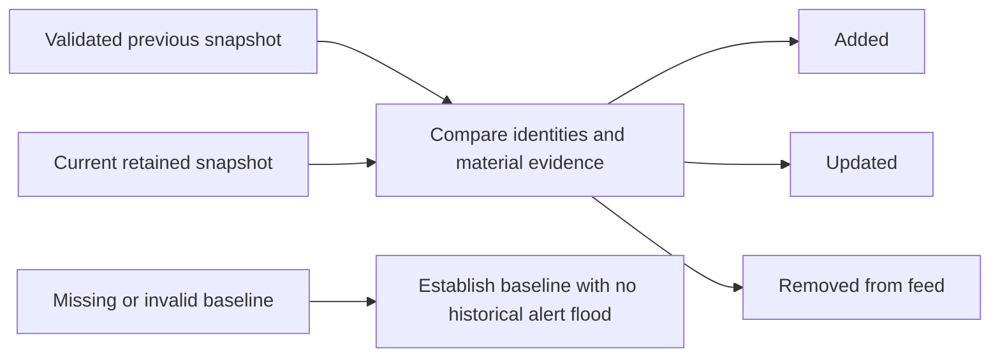

# Identity, relevance and change

## Shared record model

| Field | Meaning |
| --- | --- |
| `indicator`, `type` | Observable or CVE value and classification; together form identity. |
| `source` | Comma-separated source identifiers retained through merging. |
| `first_seen`, `last_seen` | Evidence timestamps used for history and age; interpretation depends on the adapter. |
| `confidence`, `score` | Source-assigned confidence and calculated relevance ranking. |
| `tlp`, `tags`, `reference`, `context` | Handling label and supporting context. Respect provider terms too. |
| `sightings` | Accumulated collector observations; not the number of attacks or affected hosts. |
| `vulnerability` | Structured provider reports, such as CISA KEV and NVD evidence. |

Different CVE IDs stay separate. The same CVE can combine multiple provider reports. URL scheme/host normalization must preserve case-sensitive path and query components: `/Payload` and `/payload` may be different resources. Defanging changes display spelling (`hxxps`, `[.]`); refanging restores forms used for matching.

## Explain the score

```text
base = 40 (low), 60 (medium), 80 (high); unrecognized confidence uses 50
bonus = min(8 × additional source identifiers, 16)
score = clamp(round((base + bonus) × 0.5 ^ (age_hours / half_life_hours)), 0, 100)
```

Age comes from `last_seen`, with negative age clamped to zero. Missing/unparseable dates fall back to the scoring time. That fallback is not evidence of a fresh attack; preserve real timestamps in adapters.

| Type | Half-life |
| --- | --- |
| IP address, URL | 7 days |
| Domain; unlisted type default | 14 days |
| CIDR, JA3/JA3S, email | 30 days |
| Bitcoin address | 90 days |
| File hashes | 180 days |
| CVE | 365 days |


Example: a high-confidence IP from two source identifiers starts at 88, becomes 44 after seven days without a newer sighting, then 22 after fourteen. This is a transparent ranking heuristic, **not a calibrated probability**. The bonus counts source identifiers, not verified independent providers; graph provider grouping is separate.

## Persistence and retention

With `--persist-feed`, re-observed records inherit history while prior-only records are copied forward and age. Scores below `--min-score` (default 20) expire. Optional `--max-age-days` and `--max-store` bound the result; both are off by default in the CLI. The production workflow enables 30 days and 10,000 records.

When capacity is exceeded, non-rejected KEV records whose catalog evidence was checked within 24 hours receive priority, newest KEV additions first. Remaining priority uses score, source count and stable recency tie-breaks. Age/score expiry happens before the cap, so KEV prioritization does not imply a complete KEV catalog.

The high-confidence subset includes score ≥80 by default **or** at least two source identifiers. Corroborated older records may therefore enter it below 80. It is a review set, not a guarantee of safe blocking.

## SOC Delta



Delta schema version 1 contains generation timestamps, `baseline_available`, counts and events. Updates cover source, confidence, tags, material provider evidence and score changes of at least five points or a score-band crossing. Routine polling timestamps do not create evidence updates. `removed_from_feed` means absence from the retained snapshot, not “benign.”

The baseline requires a usable previous JSONL snapshot whose loaded record count agrees with previous diagnostics. Missing/corrupt data must not turn every current record into a false “new” alert. Loaded baselines remain immutable during rescoring so genuine decay updates and removal payloads preserve their prior values.

**Implementation:** [model](https://github.com/PKHarsimran/SwiftIOC-Automated-Threat-Intelligence-Collector/blob/2725dbf95fe719b45e6d4e2d50d1952b2b34784f/swiftioc/models.py), [scoring](https://github.com/PKHarsimran/SwiftIOC-Automated-Threat-Intelligence-Collector/blob/2725dbf95fe719b45e6d4e2d50d1952b2b34784f/swiftioc/scoring.py), [Delta](https://github.com/PKHarsimran/SwiftIOC-Automated-Threat-Intelligence-Collector/blob/2725dbf95fe719b45e6d4e2d50d1952b2b34784f/swiftioc/writers.py).

---
[Wiki home](https://github.com/PKHarsimran/SwiftIOC-Automated-Threat-Intelligence-Collector/wiki) · [Interview guide](https://github.com/PKHarsimran/SwiftIOC-Automated-Threat-Intelligence-Collector/wiki/Interview-Guide) · [Documentation map](https://github.com/PKHarsimran/SwiftIOC-Automated-Threat-Intelligence-Collector/wiki/Reference-and-Glossary)

*Reviewed against main at `2725dbf9` on 21 September 2026. Live feed counts change between collections.*
