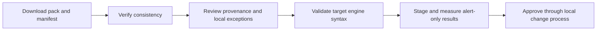

# Compile portable detection artifacts

The collector turns its curated high-confidence set into reviewable Sigma, Suricata and DNS response-policy files. Supported inputs are IP addresses, IPv4/IPv6 networks and domains. Unsupported types are reported rather than forced into inappropriate rules.

| Artifact under `public/detections/` | Purpose |
| --- | --- |
| `sigma/network-iocs.yml` | Exact network endpoint matches and CIDR modifiers. |
| `sigma/dns-iocs.yml` | Exact DNS names and label-boundary subdomains. |
| `suricata/swiftioc.rules` | Inbound/outbound IP and DNS alerts. |
| `suricata/sid-registry.json` | Persistent deterministic SID assignments and collision reservations. |
| `dns/swiftioc.rpz` | Exact and wildcard DNS triggers with NXDOMAIN policy. |
| `manifest.json` | Counts, included/skipped inputs, artifact metadata and file checksums. |

Browser Workspace can also compile a smaller selected Sigma/Suricata bundle. This happens locally, with validation and escaping before rule construction.

## Safe adoption sequence



```bash
python -m swiftioc.verify_detections public/detections --json
```

Manifest version 2 lists SHA-256 checksums and byte lengths for artifacts. The offline verifier catches missing/changed files and invalid pack metadata according to its checks. It does **not** authenticate the publisher, validate all engine-specific syntax, or prove that a rule is operationally appropriate. An attacker able to replace both files and manifest can also replace hashes.

Sigma must be converted for your target backend and field model. Suricata depends on your deployment's variables and rule validation. RPZ changes DNS answers, so review policy before enabling it. Generated experimental/alert output is not automatic authorization to block.

## Why SID persistence matters

Suricata rule IDs must remain stable when a rule disappears and later returns. Deterministic hashing alone can still collide. SwiftIOC preserves assignments, including historical reservations, in `sid-registry.json`; the collection workflow restores and commits that registry across fresh runners. Keep it with the output state in self-hosted deployments. Deleting it loses historical collision decisions.

## RPZ details

Trigger owners are relative names such as `example.invalid` and `*.example.invalid` under your chosen policy-zone origin. The CNAME target `.` is absolute and requests NXDOMAIN. A trailing dot on a trigger would change its zone meaning. Validate with your DNS tooling before deployment. The serial advances past the previous serial when generation times would otherwise repeat.

URLs, file hashes, CVEs, email addresses and other unsupported values are disclosed in the manifest's skipped information. A CVE is not an IP/network/DNS rule, and a URL path cannot safely be widened into a domain block without a separate policy decision.

**Source:** [compiler](https://github.com/PKHarsimran/SwiftIOC-Automated-Threat-Intelligence-Collector/blob/2725dbf95fe719b45e6d4e2d50d1952b2b34784f/swiftioc/detections.py), [verifier](https://github.com/PKHarsimran/SwiftIOC-Automated-Threat-Intelligence-Collector/blob/2725dbf95fe719b45e6d4e2d50d1952b2b34784f/swiftioc/verify_detections.py), [detection design](https://github.com/PKHarsimran/SwiftIOC-Automated-Threat-Intelligence-Collector/blob/2725dbf95fe719b45e6d4e2d50d1952b2b34784f/docs/DETECTION_PACK.md).

---
[Wiki home](https://github.com/PKHarsimran/SwiftIOC-Automated-Threat-Intelligence-Collector/wiki) · [Interview guide](https://github.com/PKHarsimran/SwiftIOC-Automated-Threat-Intelligence-Collector/wiki/Interview-Guide) · [Documentation map](https://github.com/PKHarsimran/SwiftIOC-Automated-Threat-Intelligence-Collector/wiki/Reference-and-Glossary)

*Reviewed against main at `2725dbf9` on 21 September 2026. Live feed counts change between collections.*
