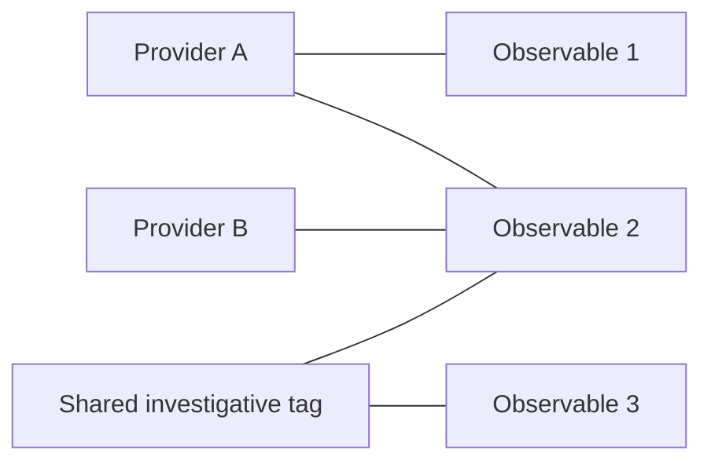

# Read the graph as evidence

The graph connects observable indicators to reporting-provider and tag pivots. It makes shared evidence visible without claiming that every cluster is a real campaign.

In this illustrative graph, Observable 2 is reported by two providers and shares a tag with Observable 3. That justifies investigating a relationship. It does not prove shared infrastructure ownership, causality or attribution to a threat actor.

## Provider names must mean something

Raw names such as `threatfox_export_json` describe ingestion adapters. The dashboard groups known aliases into readable providers. Multiple abuse.ch exports do not become multiple independent providers merely because they have different adapter names. Aggregate/context feeds are distinguished from direct reporting providers.

Provider grouping affects graph presentation. The Python scoring bonus still counts source identifiers; do not describe it as verified provider independence. Known feed-name tags, including aliases such as ThreatFox and CINS, are excluded from uncommon-tag investigative leads.

## Explore a cluster

1. Start with the preview's filters so the graph answers a focused question.
2. Switch between provider/source, tag or combined relationships.
3. Choose 24, 36 or 48 indicators; phones begin with the smaller view.
4. Select a node to highlight its direct neighbors and inspect evidence.
5. Add a useful IOC to Workspace or export the displayed evidence/neighborhood.
6. Click empty graph space or press Escape to reset selection.

Arrow keys move between nodes; Home/End jump; Enter/Space select. Search refangs IOC labels and queries, so an ordinary IP can match `[.]` display spelling and an HTTP URL can match `hxxp`. Provider/tag matching retains its literal meaning.

## Boundaries keep the view usable

Rendering is bounded to at most **48 indicators and eight pivots**. Singleton pivots are excluded, and counters should include only pivots represented by selected edges. The displayed sample can omit real relationships. Graph size is not the full feed size, and visible high-risk counts describe the sample.

Layout remixing changes presentation, not evidence. Node selection, highlighting and the inspector should remain consistent through filter, density and refresh changes. Motion respects reduced-motion preferences in the dashboard.

## Discovery lenses

| Lens | What it surfaces | What it does not establish |
| --- | --- | --- |
| Cross-source | Multiple distinct named sources; up to six ranked leads. | Verified independence of those sources. |
| Recent sightings | Valid last-seen time within 24 hours; future times excluded. | A new attack or first discovery. |
| Uncommon tags | Nongeneric investigative tags on at most three distinct indicators in the filtered sample. | Global rarity across the internet or all retained feeds. |

Filtered or unavailable data updates the graph and discovery desk together. Failed refreshes should clear actionable findings and disable exports rather than retaining a misleading selection.

**Further detail:** [graph design](https://github.com/PKHarsimran/SwiftIOC-Automated-Threat-Intelligence-Collector/blob/2725dbf95fe719b45e6d4e2d50d1952b2b34784f/docs/THREAT_CAMPAIGN_GRAPH.md), [browser core](https://github.com/PKHarsimran/SwiftIOC-Automated-Threat-Intelligence-Collector/blob/2725dbf95fe719b45e6d4e2d50d1952b2b34784f/public/assets/dashboard-core.js).

---
[Wiki home](https://github.com/PKHarsimran/SwiftIOC-Automated-Threat-Intelligence-Collector/wiki) · [Interview guide](https://github.com/PKHarsimran/SwiftIOC-Automated-Threat-Intelligence-Collector/wiki/Interview-Guide) · [Documentation map](https://github.com/PKHarsimran/SwiftIOC-Automated-Threat-Intelligence-Collector/wiki/Reference-and-Glossary)

*Reviewed against main at `2725dbf9` on 21 September 2026. Live feed counts change between collections.*
