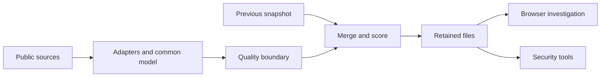

# Explain SwiftIOC confidently

Use these as practice material, then describe the work you personally understand and can demonstrate. Be precise about your contribution, assistance and evidence. Do not claim customer scale, measured performance, security guarantees or production impact without supporting measurements.

## A 30-second explanation

> SwiftIOC is a Python collector and static threat-intelligence dashboard. It normalizes public feeds into attributed IOC and CVE records, maintains a scored and bounded snapshot, and helps an analyst turn that evidence into an investigation or portable hunt. The design emphasizes explainability: provenance stays with each record, exploitation evidence is separated from severity, and failed quality checks can preserve the previous publication.

## A two-minute explanation

1. **Problem:** analysts receive different feed formats and need to preserve meaning, freshness and provenance while building a focused working set.
2. **Architecture:** source adapters emit one model; Python filters, merges, scores and publishes files. The browser reads those files without a backend API.
3. **Analyst value:** lookup, provider/tag pivots, a local queue, mapped SPL and detection exports help move from a report to a testable hypothesis. CVEs have a separate evidence/applicability workflow.
4. **Reliability:** quality rejection keeps the previous feed; validated baselines prevent alert floods; copies preserve historical state during rescoring; deterministic exports and SID reservations support consumers.
5. **Tradeoff:** simple static deployment limits collaborative cases and real-time enrichment. The next step would be coherent versioned publication and measured feed-quality/performance targets, not just more animations.

## Draw this on a whiteboard

Explain **identity**, **failure behavior** and **trust boundaries** while drawing. Then walk one IP through deduplication, persistence, score decay, queue selection and a mapped hunt. Switch to a CVE to show why the workflow differs.

## Five-minute demo script

| Time | Demonstration | Point to explain |
| --- | --- | --- |
| 0:00–0:40 | Show snapshot timestamp and source diagnostics. | An available site can still serve stale data. |
| 0:40–1:30 | Pick a retained observable, inspect provenance, then use a graph pivot. | Relationships are investigative evidence, not attribution. |
| 1:30–2:20 | Queue two supported IOCs, open Workspace, configure SPL. | Queries depend on real field mappings; the browser does not execute them. |
| 2:20–3:15 | Open Known exploited CVEs and review dates/action. | KEV exploitation differs from NVD severity and new publication. |
| 3:15–4:10 | Import a synthetic inventory using the UI sample. | Version applicability has uncertainty; no match is not a safety verdict. |
| 4:10–5:00 | Show one regression test and a quality-rejection path. | Correctness and recovery are product features. |

Use synthetic assets and the current retained feed. If live data is unavailable, explain the failure state or use the repository's fixture-based tests; do not present invented results as live findings.

## Design questions and strong answers

**Why Python plus a static frontend?** Python is convenient for adapters, parsing and structured exports. Static hosting makes browsing independent of collection, keeps operational requirements small and avoids sending local investigation state to an application server. The cost is snapshot latency and limited shared workflow.

**How do you deduplicate without losing information?** Use `(type, indicator)` identity after type-aware normalization, merge provenance and preserve temporal/evidence fields. Do not lowercase a whole URL. Different CVE IDs remain distinct while provider reports for the same ID combine.

**What does an 88 score mean?** With high confidence and two source identifiers, the heuristic starts at 80+8 and decays by indicator-specific age. It ranks relevance; it is not an 88% probability. Source identifiers are not verified independent providers.

**How do you know a CVE is exploited?** CISA KEV evidence supports that statement. NVD severity alone does not. Asset applicability needs product/version/configuration evidence and local verification; SwiftIOC does not scan endpoints.

**What happens when a feed fails?** Per-source failures are recorded and partial collection may continue. Configured required-source quality checks can reject publication and preserve the last baseline. A later-page NVD failure keeps already-fetched pages, which is useful but partial coverage.

**How is publication atomic?** Each file is written through temporary-file replacement, with public-readable permissions. The directory is not a single transaction. I would improve this with immutable generation directories and one atomic manifest switch.

**Why not always block high-confidence indicators?** The subset also admits multi-source records below the numeric threshold, sources may overlap, and infrastructure can change ownership. Deployment needs local allowlists, provenance review and staged alert-only validation.

**How do you avoid browser freezes?** Bound displayed graph/queue sizes and index CVE evidence by product before matching inventory. Validate with a supported worst-case fixture and measure main-thread latency; do not substitute a record cap for a benchmark.

**How do you handle secrets in threat feeds?** Omit the complete affected record at the publication boundary, including prior records used in Delta; keep raw capture private. The current Google-key pattern is a targeted safeguard. It does not revoke keys or clean historical copies.

**How would you scale?** First measure response sizes, fetch latency, memory, source error rates and browser assessment/render time. Then introduce coherent versioned snapshots, incremental processing and possibly a worker/API where measurements justify them. Multi-user cases require authentication, authorization and audit design, not merely cloud storage.

## Real bug-fix stories to practice

Use Situation → Task → Action → Result. State the verified behavioral result; do not invent business metrics.

| Story | Failure mechanism | Fix principle | Evidence to show |
| --- | --- | --- | --- |
| Hidden decay updates | Previous-only records were shared by reference and rescored in place. | Copy carried-forward objects and nested evidence before mutation. | `merge_with_previous` plus baseline/Delta regression tests. |
| False “all new” alerts | A snapshot path existed but its data was unusable. | Validate the loaded baseline against diagnostics before enabling comparison. | CLI baseline validation and truncated-input tests. |
| Inventory responsiveness | Every asset repeatedly traversed every CVE configuration. | Index product evidence before matching candidate assets. | Inventory core and large mostly-unmatched fixture. |
| Incorrect version match | Numeric comparison made exact `2.4` equal `2.4.0`. | Literal exact versions; numeric ordering only for range bounds. | Inventory version tests. |
| Credential publication | Upstream phishing data contained credential-shaped text. | Whole-record omission before all public outputs and prior-Delta payloads. | Publication tests and security policy. |
| Unstable detection identity | A removed rule's SID could be reassigned during collision handling. | Retain historical reservations and persist the registry across runners. | Detection tests and workflow registry restoration. |

## Questions to ask yourself before an interview

- Can I point to the actual module for every stage I describe?
- Can I explain a result that is uncertain rather than calling it safe/vulnerable?
- Can I distinguish a source count, a provider count and a retained/displayed count?
- Can I demonstrate recovery from a failure, not just the happy path?
- Can I name one limitation and a measurable, proportionate improvement?
- Can I explain which parts I implemented/reviewed and how I validated assisted work?

Next: [Architecture](https://github.com/PKHarsimran/SwiftIOC-Automated-Threat-Intelligence-Collector/wiki/Architecture), [security boundaries](https://github.com/PKHarsimran/SwiftIOC-Automated-Threat-Intelligence-Collector/wiki/Security-and-Privacy), [roadmap and measurable outcomes](https://github.com/PKHarsimran/SwiftIOC-Automated-Threat-Intelligence-Collector/wiki/Roadmap-and-Tradeoffs).

---
[Wiki home](https://github.com/PKHarsimran/SwiftIOC-Automated-Threat-Intelligence-Collector/wiki) · [Interview guide](https://github.com/PKHarsimran/SwiftIOC-Automated-Threat-Intelligence-Collector/wiki/Interview-Guide) · [Documentation map](https://github.com/PKHarsimran/SwiftIOC-Automated-Threat-Intelligence-Collector/wiki/Reference-and-Glossary)

*Reviewed against main at `2725dbf9` on 21 September 2026. Live feed counts change between collections.*
