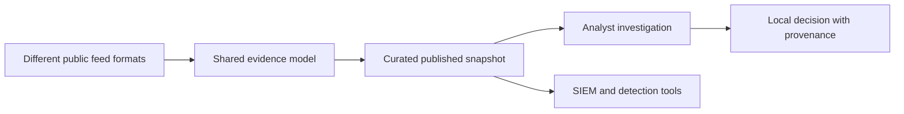

# What SwiftIOC does

Security teams receive IP addresses, domains, URLs, hashes and vulnerability reports from different providers. Each source has its own format, time semantics and reliability. Copying them into spreadsheets loses provenance; searching every feed manually is slow; blindly turning them into blocks can create false positives.

SwiftIOC provides a small, inspectable path from those inputs to a working investigation:

- Python fetches configured feeds, normalizes records, filters false positives, merges duplicate identities and records provenance.
- A living feed can carry forward prior observations, apply relevance decay and retain a bounded snapshot.
- Static files expose the result in human- and machine-readable formats.
- A browser dashboard provides lookup, relationship pivots, vulnerability review, a local investigation queue and portable hunt output.

## Who benefits

| Audience | Useful outcome |
| --- | --- |
| SOC analyst | Build a focused IOC queue and generate searches with the underlying evidence. |
| Vulnerability analyst | Review known-exploited CVEs and compare reported product/version applicability. |
| Detection engineer | Inspect portable rules and feed updates before staging them. |
| Student or interviewer | Follow a complete Python-to-browser data product and inspect real correctness tradeoffs. |
| Maintainer | See source errors, quality rejection, retention and publication behavior in diagnostics. |

## What makes the design useful

**Evidence stays attached.** Records retain source identifiers, timestamps, references, tags and structured CVE provider reports. Exports should support a decision that can be explained later.

**Collection and browsing are decoupled.** There is no Python API server behind each page view. Hosting static files is inexpensive and browsing does not repeatedly call upstream feeds. The tradeoff is snapshot freshness and limited collaborative state.

**Different evidence gets different workflows.** Observable hunts, CISA exploitation evidence, NVD applicability and an analyst's inventory assertions are not interchangeable.

**Failure is part of the product.** Quality gates can preserve the previous publication; a rejected attempt has its own diagnostics; a failed browser refresh must disable stale exports.

## Current scope and limits

SwiftIOC is not an endpoint scanner, a complete vulnerability database, a TAXII server, or a managed SOC. It has no shared case database, account synchronization or role-based workspace access. Graph edges represent shared reporting/tags, not established campaign attribution. Source-count scoring does not verify that providers are independent.

The production collection configuration uses a four-hour schedule, 30-day age retention and a 10,000-record cap. Those are configured operating choices, not throughput claims or a freshness SLA. The compact preview defaults to 1,000 records. Always state which sample or collection a count describes.

## Recent changes this guide includes

- September 19: compact IOC action menus and type-aware quick SPL searches.
- September 16 consolidation: current lint/type checks and private raw-capture behavior, including no implicit raw capture from `--ci-safe`.
- Publication quality gates preserve the previous feed on configured rejection.
- Credential-shaped collected records are omitted before exports, including prior records used by Delta.
- Detection packs have consistency verification and persistent Suricata SID reservations.

See [the current README](https://github.com/PKHarsimran/SwiftIOC-Automated-Threat-Intelligence-Collector/blob/main/README.md) and [code history](https://github.com/PKHarsimran/SwiftIOC-Automated-Threat-Intelligence-Collector/commits/main) for changes after this guide's review date.

---
[Wiki home](https://github.com/PKHarsimran/SwiftIOC-Automated-Threat-Intelligence-Collector/wiki) · [Interview guide](https://github.com/PKHarsimran/SwiftIOC-Automated-Threat-Intelligence-Collector/wiki/Interview-Guide) · [Documentation map](https://github.com/PKHarsimran/SwiftIOC-Automated-Threat-Intelligence-Collector/wiki/Reference-and-Glossary)

*Reviewed against main at `2725dbf9` on 21 September 2026. Live feed counts change between collections.*
