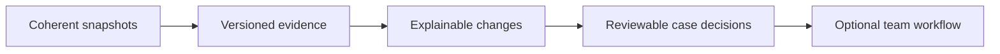

# Improve the product with measurable outcomes

The following are proposals, not shipped features. Prioritize reliability and analyst trust before expanding the interface. A small product with clear evidence and dependable recovery is more credible than a broad dashboard with unclear claims.

## Recommended order

| Priority | Improvement | Why it matters | Acceptance evidence |
| --- | --- | --- | --- |
| 1 | Immutable publication generations and one current-manifest pointer | Avoid mixed-generation files, baselines and signature races. | Interrupt publication at each write; readers keep a coherent prior/current generation. |
| 2 | Feed contracts and explicit partial-coverage state | Distinguish empty, failed, truncated, stale and partially paginated results. | Fixtures for each state; diagnostics and UI show the same coverage meaning. |
| 3 | Provider-aware provenance in ranking | Avoid treating aliases/aggregators as independent corroboration. | Auditable provider mapping, score explanations and regression comparisons. |
| 4 | Measured frontend performance budgets | Keep large retained snapshots and inventory checks responsive. | Published benchmark fixture, hardware/browser context, p50/p95 duration and main-thread blocking time. |
| 5 | Evidence-linked case export | Package selected IOC/CVE evidence, queries, snapshot identity and analyst reasoning. | Reopen an exported case with provenance intact and explicit missing/stale evidence. |
| 6 | Optional collaborative backend | Team queues, roles, audit trails and shared case state. | Permission tests, retention policy, migration path and backup/recovery exercise. |

## A distinctive product direction

An **explainable evidence-change briefing** would build on the current Delta, product watches and queue. Instead of saying “this score changed,” it could show which provider evidence changed, why an asset moved in priority, which prior decision used the old evidence, and what the analyst should verify next.

That requires reliable generation identity, evidence versioning and explicit uncertainty first. Treat this as a direction to validate with analysts, not a claim that the feature is unique in the market.

## Tradeoffs worth keeping visible

| Current choice | Benefit | Cost / trigger for change |
| --- | --- | --- |
| Static files | Simple hosting and offline-friendly exports. | Snapshot latency; change when coherent incremental/live needs are measured. |
| Browser-local workspace | No account setup or upload of inventory. | No cross-device/team state; add backend only with clear privacy/access design. |
| Bounded graph and retained feed | Predictable payload/render size. | Incomplete coverage; expose limits rather than hiding them. |
| Heuristic score | Understandable factors and cheap computation. | Not calibrated likelihood; measure usefulness with analyst feedback. |
| Conservative applicability | Avoid unsupported “vulnerable” verdicts. | More manual review; improve evidence coverage before stronger claims. |

## Metrics to collect before promising commercial readiness

Track successful-source coverage, snapshot age, partial collection frequency, quality rejections, publication consistency, detection verification failures, investigation task completion and query false-positive/false-negative behavior on known fixtures. Add accessible keyboard and mobile task checks. Describe test hardware, data distribution and sample size with any performance number.

Commercial readiness also involves licensing/terms, support ownership, documented recovery, authorization and auditability. None of those is established by a visual redesign alone.

---
[Wiki home](https://github.com/PKHarsimran/SwiftIOC-Automated-Threat-Intelligence-Collector/wiki) · [Interview guide](https://github.com/PKHarsimran/SwiftIOC-Automated-Threat-Intelligence-Collector/wiki/Interview-Guide) · [Documentation map](https://github.com/PKHarsimran/SwiftIOC-Automated-Threat-Intelligence-Collector/wiki/Reference-and-Glossary)

*Reviewed against main at `2725dbf9` on 21 September 2026. Live feed counts change between collections.*
