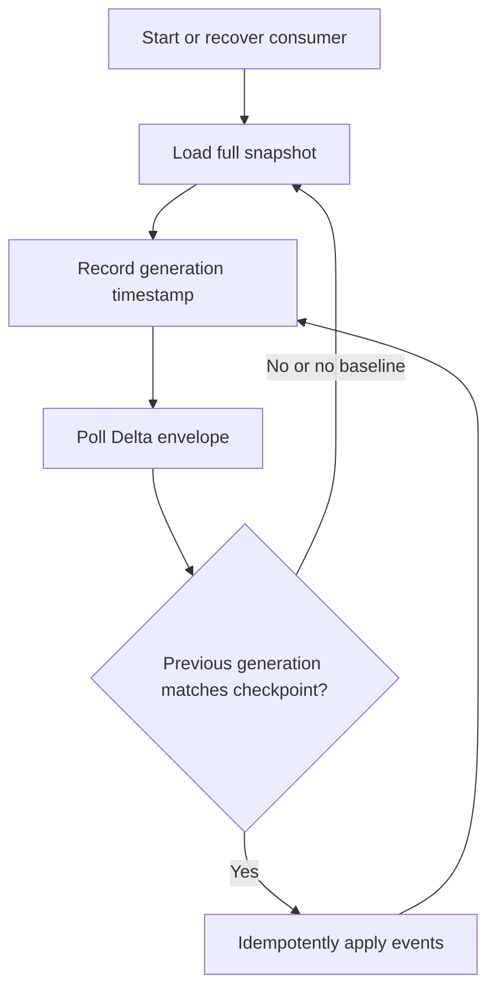

# Turn selected evidence into a hunt

SwiftIOC generates query text and files. It does not connect to Splunk or execute searches. Field extraction, data coverage, permissions, performance and interpretation belong to your deployment.

## Choose the right SPL path

| Path | Use it for | Important behavior |
| --- | --- | --- |
| Row action → Copy SPL | A quick search for one record. | Prompts for index; uses common field candidates plus raw-value terms, or CIDR matching; defaults to a 30-day lookback. |
| Workspace live SPL | A carefully selected IOC working set. | Configurable time and field mapping; lists matching queued IOCs per result; excludes unsupported types. |
| Splunk hunt library | Reusable full-feed/lookup workflows. | Guided lookup setup and downloadable templates. |

The newer quick action can search CVE-like fields or raw CVE text. **That only finds logged mentions**, for example in scanner results. It cannot determine installed-software vulnerability. The workspace intentionally excludes CVEs from IOC SPL and offers a verification checklist for CVE-only queues.

## Workspace hunt steps

1. Queue supported observables: IP/CIDR, exact DNS domain, full URL, MD5/SHA-1/SHA-256.
2. Choose a relevant index or index pattern rather than searching unrelated data. The UI accepts `*`, patterns such as `security_*`, or a comma-separated list.
3. Choose the time range. Shorter relevant ranges reduce unnecessary scanning.
4. Map extracted, single-valued fields: source/destination IP, DNS query, URL and hashes.
5. Review included/skipped counts and generated query text. Invalid configuration disables export.
6. Validate with a known benign test event in your own telemetry; check that the intended IOC is identified and unrelated data is excluded.
7. Save the query with the evidence and snapshot timestamp used to generate it.

Matching semantics matter. Network ranges need CIDR matching. Exact domains are not arbitrary substring matches. URL paths/query components may be case-sensitive. Missing event fields or transformations in your logging pipeline can cause false negatives. The quick search is broader than the mapped workspace query; do not describe them as equivalent.

[Open the hunt library](https://harsim.ca/SwiftIOC-Automated-Threat-Intelligence-Collector/splunk/). Query sources and their page generator live in [public/splunk](https://github.com/PKHarsimran/SwiftIOC-Automated-Threat-Intelligence-Collector/tree/main/public/splunk) and [scripts/build_splunk_guide.py](https://github.com/PKHarsimran/SwiftIOC-Automated-Threat-Intelligence-Collector/blob/2725dbf95fe719b45e6d4e2d50d1952b2b34784f/scripts/build_splunk_guide.py).

## Snapshot and Delta consumers

Delta is the latest comparison, not an indefinitely retained message queue. A consumer that misses runs can miss intermediate changes. Use the JSON envelope's generation/baseline fields, checkpoint successfully applied generations, and recover from the full snapshot when continuity is lost. JSONL is convenient for streaming events but does not carry the whole envelope.

Use `(type, indicator)` as the upsert/delete key while preserving URL identity. `added` and `updated` carry `current`; `removed_from_feed` carries `previous`. Removal withdraws an IOC from this working set, not from every security control or investigation automatically.

Elastic and Sentinel require your own ingestion/mapping process; the repository provides [integration starters](https://github.com/PKHarsimran/SwiftIOC-Automated-Threat-Intelligence-Collector/blob/2725dbf95fe719b45e6d4e2d50d1952b2b34784f/integrations/README.md), not a managed connector. MISP and STIX exports offer other interoperability paths. The TAXII-formatted envelope is a file, not a TAXII API service.

## Verify before consuming

Canonical feeds can have Sigstore bundles from the signing workflow. Download the exact matching feed/bundle generation and verify using the identity/issuer policy documented in the [integration guide](https://github.com/PKHarsimran/SwiftIOC-Automated-Threat-Intelligence-Collector/blob/2725dbf95fe719b45e6d4e2d50d1952b2b34784f/integrations/README.md). Signing is a separate workflow, so independently fetching mutable “latest” files can produce a temporary mismatch. Retry a coherent generation; never bypass a failed verification as if it had passed.

Detection-pack checksums serve a different purpose: [pack consistency verification](https://github.com/PKHarsimran/SwiftIOC-Automated-Threat-Intelligence-Collector/wiki/Detection-Packs) is not publisher authentication.

---
[Wiki home](https://github.com/PKHarsimran/SwiftIOC-Automated-Threat-Intelligence-Collector/wiki) · [Interview guide](https://github.com/PKHarsimran/SwiftIOC-Automated-Threat-Intelligence-Collector/wiki/Interview-Guide) · [Documentation map](https://github.com/PKHarsimran/SwiftIOC-Automated-Threat-Intelligence-Collector/wiki/Reference-and-Glossary)

*Reviewed against main at `2725dbf9` on 21 September 2026. Live feed counts change between collections.*
