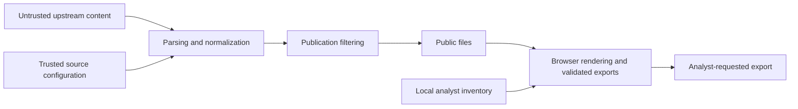

# Trust boundaries and privacy

Threat feeds are untrusted data. Source configuration, imported parser code and the operator's environment are trusted components. A defensive tool must avoid turning upstream content into unsafe requests, executable markup, malformed rules or public credential leaks.

## HTTP controls and their limits

The HTTP layer bounds redirect chains to five hops, streams responses under a 100 MiB limit, and retries selected transient failures. Cross-origin redirects strip known sensitive headers including NVD `apiKey`, Authorization and Cookie. Redirect destinations must resolve to public addresses; internal/link-local/loopback targets are rejected.

Configured initial source URLs are trusted and are not checked by the redirect validator. DNS validation is not a substitute for network egress policy or a sandbox. The response cap is per response, not a guarantee on total process memory. Inspect [http_client.py](https://github.com/PKHarsimran/SwiftIOC-Automated-Threat-Intelligence-Collector/blob/2725dbf95fe719b45e6d4e2d50d1952b2b34784f/swiftioc/http_client.py) before treating these controls as a complete SSRF defense.

## Collected credential handling

Phishing URLs can contain third-party credentials. Their appearance in a feed does not establish that the project owns or uses the credential. The publication filter drops whole records containing recognizable Google-API-key-shaped values, including nested evidence and a URL-decoded representation. It also filters prior records before Delta removal payloads can republish them.

Whole-record omission preserves meaning: deleting only the key could create an unobserved URL, and replacing it with a domain could widen a detection. Omission counters explain the count difference. The safeguard is targeted, not a comprehensive secret scanner; standalone writer callers must filter their own inputs.

Do not test an exposed key or paste it into public discussions. Removing it from current output does not revoke it or erase old commits/artifacts/forks. Follow [SECURITY.md](https://github.com/PKHarsimran/SwiftIOC-Automated-Threat-Intelligence-Collector/blob/2725dbf95fe719b45e6d4e2d50d1952b2b34784f/SECURITY.md) for ownership, revocation and reporting guidance. Raw capture is unsanitized and must stay private.

## Browser state and exported data

The dashboard fetches public feeds but does not upload your investigation queue or asset inventory. Queue/watches/review state can persist in local storage. Inventory and undo state are memory-only. A downloaded report can include local asset identifiers and evidence, so handle the export according to your environment's policy.

Browser-local storage is not encrypted case management. Other users of the same browser profile or compromised page execution can access it. Avoid storing secrets in notes/identifiers, and export/clear state deliberately on shared machines. Shared URLs may expose query terms when you choose to share them.

## Output and supply-chain boundaries

CSV output guards spreadsheet-formula-shaped values; browser exports validate types and escape rule syntax. Atomic writers preserve readable permissions for public files. These reduce specific failure modes, not every possible misuse of an export.

Detection-manifest hashes check pack consistency; Sigstore feed bundles verify publisher identity under the chosen policy. They answer different questions. Dependencies and Actions are checked through CI, dependency auditing and CodeQL, but a green check is not proof of zero vulnerabilities.

## Report a project vulnerability

Use [private vulnerability reporting](https://github.com/PKHarsimran/SwiftIOC-Automated-Threat-Intelligence-Collector/security/advisories/new), with affected commit, impact and a minimal reproduction. Do not publish live credentials or private asset details. Latest main is the maintained security target; see [the security policy](https://github.com/PKHarsimran/SwiftIOC-Automated-Threat-Intelligence-Collector/blob/main/SECURITY.md) for current commitments.

---
[Wiki home](https://github.com/PKHarsimran/SwiftIOC-Automated-Threat-Intelligence-Collector/wiki) · [Interview guide](https://github.com/PKHarsimran/SwiftIOC-Automated-Threat-Intelligence-Collector/wiki/Interview-Guide) · [Documentation map](https://github.com/PKHarsimran/SwiftIOC-Automated-Threat-Intelligence-Collector/wiki/Reference-and-Glossary)

*Reviewed against main at `2725dbf9` on 21 September 2026. Live feed counts change between collections.*
